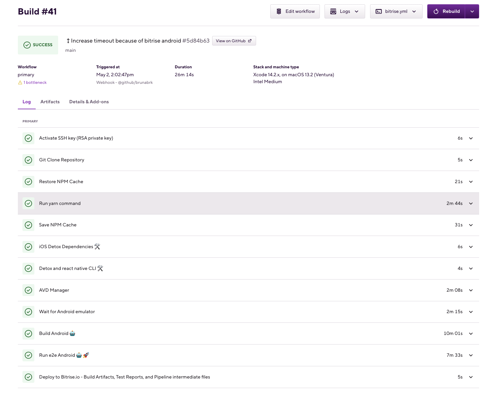

# Circle Home Challenge

This challenge uses the Hey Linda project as a base: https://github.com/heylinda/heylinda-app and has the purpose of testing the app.

## Features Tested

- Meditate
- Track progress
- Time listened

## Test Cases

Please check: [Test Cases](test-cases/doc.md)

## Automation

The tool used was [Detox](https://wix.github.io/Detox/) to cover both platforms. The relevant test cases that warranted E2E tests were covered, the other ones should be covered in another test levels.

## Prerequisites

**Detox**

- `yarn global add detox-cli`

For mac only:

```
  brew tap wix/brew
  brew install applesimutils
```

For more information about Detox setup please refer: [Detox getting started](https://wix.github.io/Detox/docs/introduction/getting-started)

**App**

```
yarn global add expo-cli
yarn install
```

For more information about App setup please refer: [HeyLinda app](https://github.com/heylinda/heylinda-app)

## Before Running the Tests

- Please have an emulator/a simulator installed and added to **_.detoxrc.js_** . Refer to [Detox](https://wix.github.io/Detox/docs/introduction/project-setup#step-3-device-configs)
- Create the iOS build using the following command:

```
yarn expo prebuild --platform ios
```

- Make sure the for React-native is running while testing the app:

```
yarn react-native start
```

## How to Run

**iOS**

```
yarn test:e2e:ios
```

**Android**

```
yarn test:e2e:android
```

## Artifacts

In case of failure a video and screenshots will be created in the artifacts folder.

## CI/CD

There are two examples of CI configurations in the project. The bitrise example is the most extensive and well tested due to monthly usage restrictions on github actions

**Bitrise**

You can see the CI and builds on the following url:
[pending url](https://bitrise.io)

Because of bitrise free plan limit of 30 minutes per build, it was impossible to run both ios and android builds with the free plan.

Given this constraint, I made the workflow run for iOS only [(iOS only workflow definition)](bitrise.yaml), but I validated that the android parts of the build pass as well, as seen here 

Ultimately, the build should include both platforms, so I created this [Bitrise definition including iOS and Android](bitrise_complete.yml) with the full solution.

**GitHub Actions**

Please see for [iOS](.github/workflows_example/e2e-ios.yaml) and android [Android](.github/workflows_example/e2e-android.yaml)

## Improvements

- Detox automatically recognizes the emulator/simulator
- Start the react-native server before the tests and kill it after

---

## 📝 **NOTE**

🚨 There is an open issue in Detox that doesn't allow it to interact with any android emulator above 31! Please make sure to use an emulator with SDK < 32 (e.g: SDK 31). See issue [Detox Issue](https://github.com/wix/Detox/issues/3762) 🚨

---
